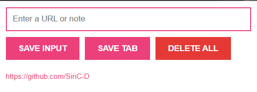

# Save This Tab

Save This Tab is a simple Chrome extension that lets you quickly save the current tab URL or custom notes with a single click.

It is designed for fast, lightweight saving without opening bookmarks or external tools.

---

## 📸 Screenshot

Below is the extension popup interface:



---

## ✨ Features

- Save the current active tab URL
- Save custom text or notes manually
- Persistent storage using browser `localStorage`
- Clickable saved links (open in a new tab)
- Delete all saved entries with one click
- Clean and minimal popup UI

---

## 🛠 Tech Stack

- HTML
- CSS
- JavaScript
- Chrome Extensions API (`tabs`)
- Browser `localStorage`

---

### 📦 Project Structure

```text
save-this-tab/
├── index.html      # Popup UI
├── styles.css      # Styling
├── script.js      # Logic and Chrome API usage
├── manifest.json   # Chrome extension configuration
├── icon.png        # Extension icon
├── popup.png       # Popup screenshot
└── README.md
```

---

## 🚀 Installation (Manual)

This extension can be installed manually in Google Chrome:

1. Clone or download this repository
2. Open Chrome and go to `chrome://extensions`
3. Enable **Developer Mode** (top right)
4. Click **Load unpacked**
5. Select the project folder (`save-this-tab`)
6. Pin the extension to the toolbar (optional)

---

## 🧠 How It Works

- The popup UI is built using HTML and CSS
- JavaScript handles user interactions and rendering
- The Chrome `tabs` API is used to fetch the current active tab URL
- Saved data is stored using `localStorage`, so it persists across browser sessions

---

## 🔐 Privacy & Permissions

- This extension does **not** read or modify website content
- No user data is collected or shared
- All saved data stays locally in the browser
- Only the `tabs` permission is used to fetch the active tab URL

---

## 📈 Possible Improvements

- Sync saved data using Chrome storage
- Export saved URLs
- Add confirmation before deleting all entries
- Organize saved items with tags or folders

---

## 🧑‍💻 Author

Built by **Siri Chandana** as a learning project while exploring JavaScript and Chrome extensions.
